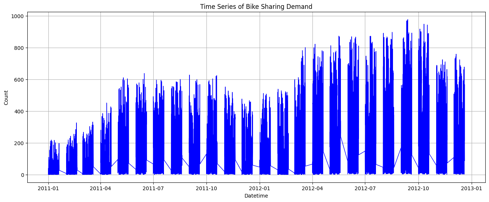
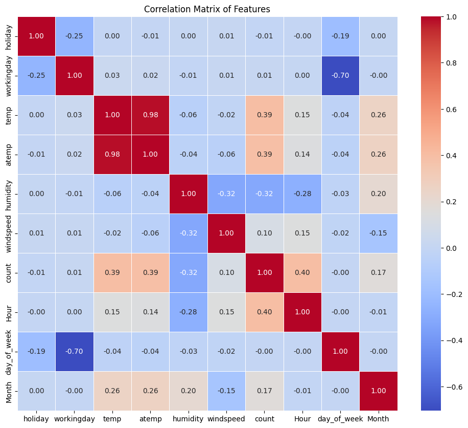
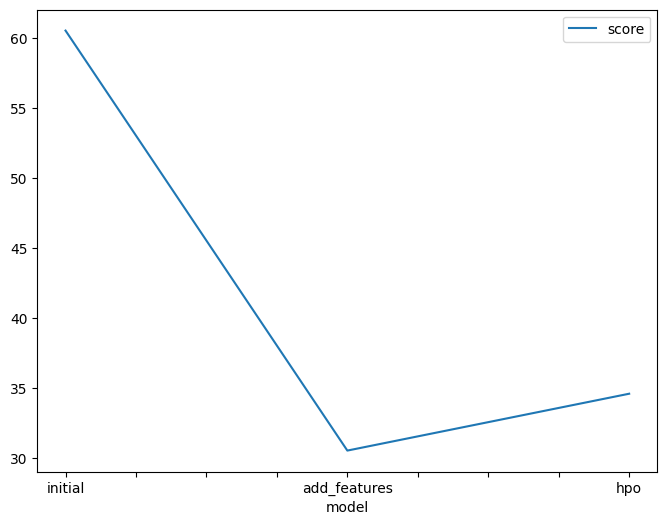
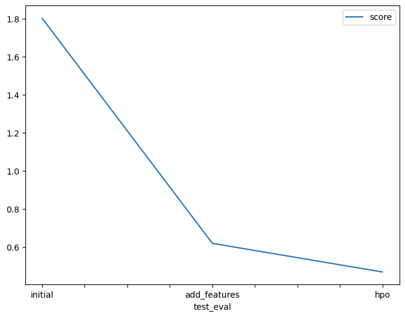

# Report: Predict Bike Sharing Demand with AutoGluon Solution
#### Simran Sagar

## Initial Training
### What did you realize when you tried to submit your predictions? What changes were needed to the output of the predictor to submit your results?
The submission needed to have all its values more than 0. Submissions with negative values were rejected by Kaggle.

### What was the top-ranked model that performed?
According to Kaggle scores, the summary() method applied to the highest-scoring model shows that the WeightedEnsemble_L3 model with added features and new hyperparameters performed the best.

## Exploratory data analysis and feature creation
### What did the exploratory analysis find and how did you add additional features?
The exploratory analysis showed the distribution and relationships within the dataset. 
I added the features- hour, day of the week, and month from the datetime column to provide the model with time details.

### How much better did your model perform after adding additional features and why do you think that is?
After adding features, the model performed better due to capturing these more relevant patterns in the data. The error decreased from 1.802 to 0.618.

### Time Series Plot of Bike Sharing Demand

### Correlation Matrix of features

## Hyperparameter tuning
### How much better did your model perform after trying different hyperparameters?
The tuning process optimized the performance of the model by adjusting parameters such as the number of boosting rounds, the number of estimators, etc. which decreased the model error from 0.618 to 0.4672.

### If you were given more time with this dataset, where do you think you would spend more time?
If more time was given, I would have spent it on feature engineering and hyperparameter tuning. There are a number of combinations of parameters that might work better than the others if tested.

### Create a table with the models you ran, the hyperparameters modified, and the kaggle score.
|model|hpo1 [time_limit]|hpo2 [presets]|hpo3 [eval_metrics]|score|
|--|--|--|--|--|
|initial|600|best_quality|root_mean_squared_error|1.8028|
|add_features|600|best_quality|root_mean_squared_error|0.6180|
|hpo|800|best_quality|root_mean_squared_error|0.4672|

### Create a line plot showing the top model score for the three (or more) training runs during the project.

### Create a line plot showing the top Kaggle score for the three (or more) prediction submissions during the project.

## Summary
The project made significant progress in improving model performance through exploratory data analysis, feature engineering, and hyperparameter tuning. However, there is still potential for further optimization with more time and exploration. By continuing to better the feature set, experiment with different models, and fine-tune hyperparameters, it's possible to achieve even better results in predicting bike-sharing demand.
Overall, the project demonstrates the iterative nature of machine learning model development and the importance of systematically exploring different ways for improvement.

